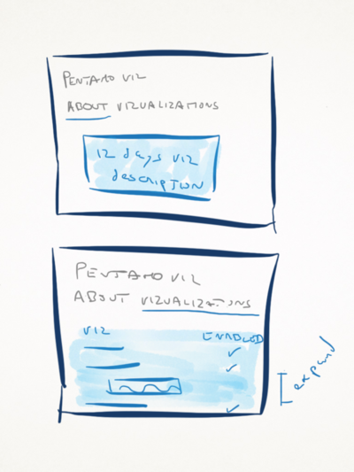

<!-- 

Here is the template we should use. Actual implementation follows

Application
=============

In this section you should have the overall description of the application.

Dashboards
==========

This section list and describes the application main visual "landing points":
the application dashboards.

## Dashboard 1
-------------

### Goal

This subsection has a description of the goal of dashboard 1

### Mockup

A screenshot of the mockup in mind

### Actions 

This subsection has a more detailed description of dashboard, including a list
of actions allowed on this dashboard, along with a mockup to give a visual
insight.

### Navigation

Here should be the information regarding the dashboard navigation restrictions
(e.g. if there should be a link to a contextual help page or where/when the user
should navigate to dashboard 2).

### Endpoints

In this subsection you will find the list of kettle end points associated to
actions on the dashboard.

Endpoints
---------

This section describes the End Points (Kettle) in the application. These
endpoints were mentioned in the previous section, in connection to the
application dashboards. Here, we have a detailed description of each one of
them, including their logic, input parameters and output types.

* Endpoint 1
	* Description:	
	* Parameters: 
	* Output: 
* Endpoint 2
	* Description: 
	* Parameters: 
	* Output:  

-->

Pentaho Visualizations
======================

A plugin to host the 12 days of visualization and whatever we decide to put
here.

Dashboards
==========

_Pentaho Visualizations_ is made of two dashboards (or for simplicity sake, just
one with hidden divs): 

* The _"About"_ with a simple descriptor
* the _"Visualizations"_ dashboard that lists the available dashboards and
  allows to enable / disable the existing ones 

Main Dashboard 
--------------

### About / Visualizations

This is a frontend to an otherwise headless plugin, as it provides extensions to
analyzer (and in the future ctools too?) visualizations. 

We'll put a description for the 12 days of viz, based on the existing info on
the website, and a list of the visualizations with an option to enable and
disable the visualizations. 

The visualizations list would be list of the existing visualizations with the
option to expand a certain row and see a screenshot / description of that
visualization.

### Original hand-made Mock-up

### UX Mock-up 

### Actions

The only option here to enable or disable the individual plugins.

### Navigation

Nothing fancy, just allowing to switch from the "About" to the "Visualizations".
Eventually links to the website.

### Endpoints

The set of Endpoints for the _Main_ dashboard are:

* listVisualizations
* enableDisableVisualization

Endpoints
=========

These endpoints were mentioned in the previous section. Here, we have a
"detailed" description of each one of them:

* listVisualizations (done)
	* Description: list available visualisations
	* Parameters: (none)
	* Output: table with the available visualizations and if they are enabled or
	  not.
* enableDisableVisualization
	* Description: Enables or disables a specific viz
	* Parameters: vizId, operation
	* Output: (operation status)
